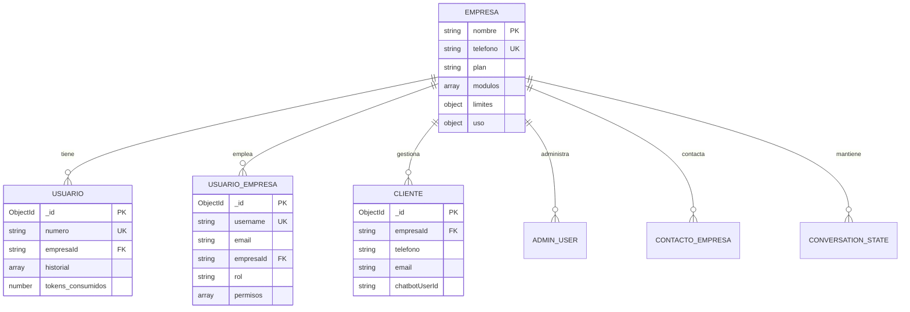

# 📊 Análisis de Base de Datos - MomentoIA

## 🎯 Resumen Ejecutivo

Base de datos analizada: **MongoDB Atlas**
Total de colecciones: **7**
Estado: **Vacía** (sin documentos aún)

---

## 📦 Colecciones Existentes

### 1. **Usuario** (Clientes de WhatsApp)
- **Propósito**: Usuarios finales que interactúan con el chatbot
- **Documentos**: 0
- **Índices**: 4
- **Campos clave**:
  - `numero` (String) - Número de teléfono ✓required 🔍indexed
  - `empresaId` (String) - Referencia a Empresa ✓required 🔍indexed
  - `empresaTelefono` (String) ✓required
  - `historial` (Array) - Historial de mensajes
  - `tokens_consumidos` (Number) - Control de uso

### 2. **Empresa** (Clientes corporativos)
- **Propósito**: Empresas que contratan el servicio
- **Documentos**: 0
- **Índices**: 3
- **Campos clave**:
  - `nombre` (String) - ID único ✓required ⚡unique 🔍indexed
  - `telefono` (String) - Número WhatsApp Business ✓required ⚡unique 🔍indexed
  - `plan` (String) - basico | standard | premium | enterprise
  - `modulos` (Array) - Sistema de módulos activados
  - `limites` (Object) - Límites según plan
  - `uso` (Object) - Uso actual de recursos

### 3. **UsuarioEmpresa** (Staff/Empleados)
- **Propósito**: Usuarios internos de las empresas (admins, managers, agents)
- **Documentos**: 0
- **Índices**: 7
- **Campos clave**:
  - `username` (String) ✓required ⚡unique 🔍indexed
  - `password` (String) - Hasheado con bcrypt ✓required
  - `email` (String) ✓required 🔍indexed
  - `empresaId` (String) - Referencia a Empresa ✓required 🔍indexed
  - `rol` (String) - admin | manager | agent | viewer
  - `permisos` (Array) - Permisos específicos
  - `activo` (Boolean)

### 4. **Cliente**
- **Propósito**: Gestión de clientes/contactos
- **Documentos**: 0
- **Índices**: 6
- **Campos clave**:
  - `empresaId` (String) ✓required 🔍indexed
  - `telefono` (String) ✓required
  - `email` (String)
  - `chatbotUserId` (String) 🔍indexed
  - `origen` (String) - Canal de origen ✓required
  - `activo` (Boolean)

### 5. **AdminUser**
- **Propósito**: Administradores del sistema
- **Documentos**: 0
- **Índices**: 4
- **Campos clave**:
  - `username` (String) ✓required ⚡unique 🔍indexed
  - `password` (String) ✓required
  - `empresaId` (String) ✓required 🔍indexed
  - `role` (String)

### 6. **ContactoEmpresa**
- **Propósito**: Contactos asociados a empresas
- **Documentos**: 0
- **Índices**: 8
- **Campos clave**:
  - `empresaId` (String) ✓required 🔍indexed
  - `telefono` (String) ✓required 🔍indexed
  - `conversaciones` (Array)
  - `metricas` (Object)
  - `activo` (Boolean)

### 7. **ConversationState**
- **Propósito**: Estado de conversaciones activas
- **Documentos**: 0
- **Índices**: 5
- **Campos clave**:
  - `telefono` (String) ✓required 🔍indexed
  - `empresaId` (String) ✓required 🔍indexed
  - `flujo_activo` (String)
  - `estado_actual` (String)
  - `data` (Mixed) - Datos del flujo
  - `pausado` (Boolean)

---

## 🔗 Relaciones Identificadas

```
Usuario
  └─> Empresa (via empresaId)

Empresa
  └─> phoneNumber (via phoneNumberId)

UsuarioEmpresa
  └─> Empresa (via empresaId)

Cliente
  └─> Empresa (via empresaId)
  └─> chatbotUser (via chatbotUserId)

AdminUser
  └─> Empresa (via empresaId)

ContactoEmpresa
  └─> Empresa (via empresaId)

ConversationState
  └─> Empresa (via empresaId)
```

**Observación importante**: 
- `Empresa` usa `nombre` (String) como identificador único
- Todas las demás colecciones referencian a `Empresa` mediante `empresaId` (String)
- No se usan ObjectId para las relaciones con Empresa

---

## 🏗️ Diagrama de Entidad-Relación



---

## 💡 Recomendaciones para Módulo Marketplace

### 📋 Modelo Propuesto: `MarketplaceIntegration`

```typescript
{
  _id: ObjectId,
  
  // Relaciones
  usuarioEmpresaId: ObjectId,     // Ref: UsuarioEmpresa._id
  empresaId: string,               // Ref: Empresa.nombre
  
  // Tipo de integración
  provider: 'google_calendar' | 'google_drive' | 'outlook' | 'zoom' | 'slack',
  
  // Credenciales OAuth (ENCRIPTADAS)
  credentials: {
    access_token: string,         // Encriptado
    refresh_token: string,        // Encriptado
    token_type: string,           // "Bearer"
    expires_at: Date,             // Timestamp de expiración
    scope: string                 // Scopes otorgados
  },
  
  // Estado
  status: 'active' | 'expired' | 'revoked' | 'error',
  granted_scopes: string[],       // Lista de permisos específicos
  connected_account: string,      // Email de la cuenta conectada
  
  // Configuración específica del provider
  config: {
    // Para Google Calendar:
    calendar_ids?: string[],
    sync_interval?: number,
    auto_sync?: boolean
  },
  
  // Auditoría
  last_sync: Date,
  sync_count: number,
  error_message?: string,
  
  // Timestamps automáticos
  createdAt: Date,
  updatedAt: Date,
  createdBy: ObjectId              // Ref: UsuarioEmpresa._id
}
```

### 🔑 Índices Recomendados

```typescript
// Índice compuesto principal
{ usuarioEmpresaId: 1, provider: 1 }  // Unique

// Índices adicionales
{ empresaId: 1, status: 1 }
{ status: 1, expires_at: 1 }  // Para refresh automático
{ provider: 1 }
```

### 🔐 Consideraciones de Seguridad

1. **Encriptación de tokens**:
   ```typescript
   import crypto from 'crypto';
   
   const ENCRYPTION_KEY = process.env.ENCRYPTION_KEY; // 32 bytes
   const IV_LENGTH = 16;
   
   function encrypt(text: string): string {
     const iv = crypto.randomBytes(IV_LENGTH);
     const cipher = crypto.createCipheriv('aes-256-cbc', Buffer.from(ENCRYPTION_KEY), iv);
     let encrypted = cipher.update(text);
     encrypted = Buffer.concat([encrypted, cipher.final()]);
     return iv.toString('hex') + ':' + encrypted.toString('hex');
   }
   
   function decrypt(text: string): string {
     const parts = text.split(':');
     const iv = Buffer.from(parts.shift()!, 'hex');
     const encrypted = Buffer.from(parts.join(':'), 'hex');
     const decipher = crypto.createDecipheriv('aes-256-cbc', Buffer.from(ENCRYPTION_KEY), iv);
     let decrypted = decipher.update(encrypted);
     decrypted = Buffer.concat([decrypted, decipher.final()]);
     return decrypted.toString();
   }
   ```

2. **Variables de entorno** (.env):
   ```bash
   # Google OAuth
   GOOGLE_CLIENT_ID=your_client_id
   GOOGLE_CLIENT_SECRET=your_client_secret
   GOOGLE_REDIRECT_URI=http://localhost:3000/api/marketplace/google/callback
   
   # Encriptación
   ENCRYPTION_KEY=your_32_byte_encryption_key_here
   ```

3. **Refresh automático de tokens**:
   - Implementar job/cron que revise tokens próximos a expirar
   - Refrescar automáticamente usando `refresh_token`
   - Notificar al usuario si el refresh falla

### 🎯 Flujo de Integración Propuesto

1. **Usuario inicia OAuth**:
   ```
   GET /api/marketplace/google-calendar/connect
   → Redirige a Google OAuth
   ```

2. **Google callback**:
   ```
   GET /api/marketplace/google-calendar/callback?code=xxx
   → Intercambia code por tokens
   → Encripta y guarda en BD
   → Redirige al dashboard
   ```

3. **Uso de la integración**:
   ```
   GET /api/marketplace/google-calendar/events
   → Verifica token válido
   → Si expiró, refresca automáticamente
   → Hace request a Google Calendar API
   ```

4. **Desconexión**:
   ```
   DELETE /api/marketplace/google-calendar/disconnect
   → Revoca tokens en Google
   → Elimina registro de BD
   ```

---

## 📊 Sistema de Módulos Existente

La colección `Empresa` ya tiene un sistema de módulos:

```typescript
modulos: [{
  id: string,
  nombre: string,
  descripcion: string,
  activo: boolean,
  configuracion: Mixed
}]
```

**Propuesta**: Integrar el marketplace con este sistema:

```typescript
// En Empresa.modulos
{
  id: 'marketplace',
  nombre: 'Marketplace de Integraciones',
  descripcion: 'Conecta con Google Calendar, Outlook, Zoom y más',
  activo: true,
  configuracion: {
    integraciones_permitidas: ['google_calendar', 'outlook', 'zoom'],
    max_integraciones_por_usuario: 5
  }
}
```

---

## ✅ Próximos Pasos

1. ✅ Análisis de BD completado
2. ⏳ Crear modelo `MarketplaceIntegration`
3. ⏳ Implementar servicio de encriptación
4. ⏳ Crear controlador OAuth para Google Calendar
5. ⏳ Implementar rutas de API
6. ⏳ Crear servicio de refresh automático de tokens
7. ⏳ Agregar módulo de marketplace a `Empresa`
8. ⏳ Frontend: Dashboard de integraciones

---

**Generado**: $(date)
**Script**: `src/scripts/analizarBaseDatos.ts`
